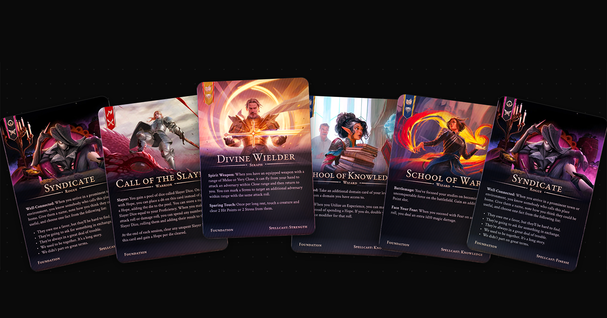

# Card Game UI Demo

Interactive card game hand UI with holographic effects, drag-and-drop, and lightbox preview. Vanilla JS, no build step.



**[Live Demo](https://jwzy.github.io/cards/)**

## Features

- **Holographic effects** — tilt, color-shift, shimmer, and glare on every card
- **Fan & flat layouts** — toggle between a fanned hand and a flat row
- **Drag & drop** — reorder cards in your hand or play them to the table
- **Lightbox preview** — click any card (hand or table) to see it full size with holographic effects
- **Field limit** — max 2 cards on the table, with visual feedback when full
- **Reset** — return all played cards to your hand
- **Mobile support** — responsive layout with horizontal scroll on small screens

## How to Run

ES modules require a local server:

```sh
# Python
python3 -m http.server

# or Node
npx serve
```

Then open `http://localhost:8000`

## Tech

- Vanilla JS (ES modules)
- CSS custom properties for fan layout math
- Pointer Events API for unified mouse/touch handling
- [holographic.js](holographic-effect/holographic.js) — zero-dependency holographic card effect library
